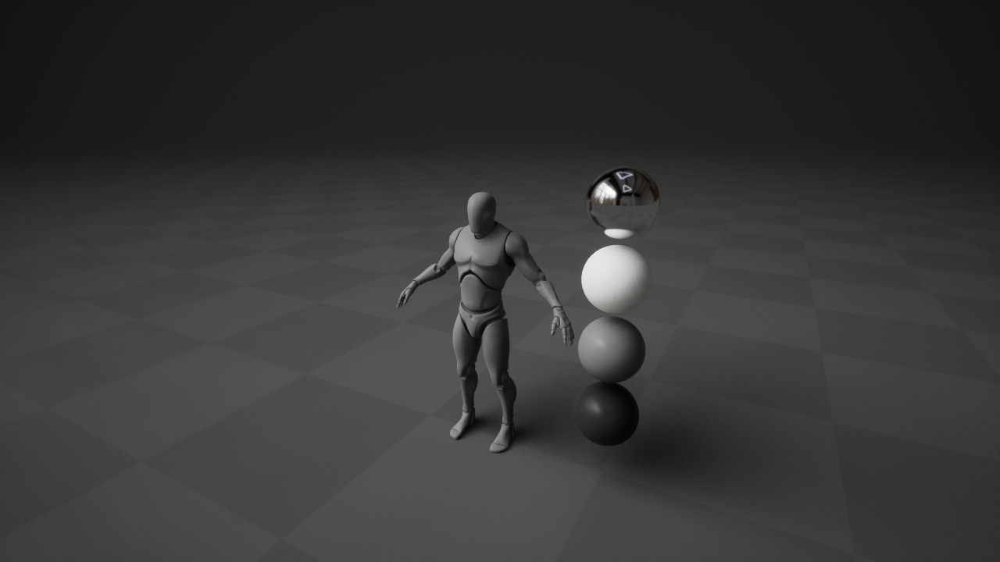

**My Unreal Engine Playground**
---

 

A free, open-source, comprehensive & (hopefully) useful collection of tech art resources for Unreal Engine. Resource list & documentation soon to follow.

**Installation Options**
---

> 1. Download/Clone the repo
>
> 2. Double click the `UE_Playground.uproject`
>
>3. Do whatever you want with the assets. You can freely migrate them to your own projects (even commercial ones) or study them at your discretion

 
**How to Contribute**
---

You are more than welcome to contribute with your own materials, vfx or anything tech art related really. Before you do so, please make sure that you have the rights to do that, understand that you will be sharing your assets for free and that you are ok with me making some minor changes to them for consistency reasons. For more info on licensing, please refer [here](https://choosealicense.com/licenses/mit/).
  If you're cool with all of the above, you can contribute using the following steps:

> 1. Clone repo and create a new branch: `$ git checkout https://github.com/cubosaur/ue-playground -b name_for_new_branch`.
> 
> 2. Make changes and test
> 
> 3. Submit Pull Request with comprehensive description of changes, ideally with some screenshots/gifs on the `img/` folder.

...or simply message me on Discord (Tsif#9659). Feedback on already-existing assets is always welcome!